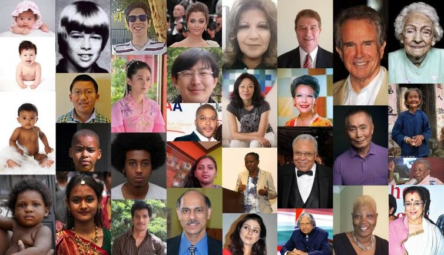

# cnn_age_gender
# Age and Gender prediction using Keras 
 <h2><a href="https://www.kaggle.com/jangedoo/utkface-new">Dataset</a> example :</h2>
  
 <h3>Description :</h3>
UTKFace dataset is a large-scale face dataset with long age span (range from 0 to 116 years old). The dataset consists of over 20,000 face images with annotations of age, gender, and ethnicity. The images cover large variation in pose, facial expression, illumination, occlusion, resolution, etc. This dataset could be used on a variety of tasks, e.g., face detection, age estimation, age progression/regression, landmark localization, etc.

 <h2>Results :</h2>
 

 
 
 
 
  

